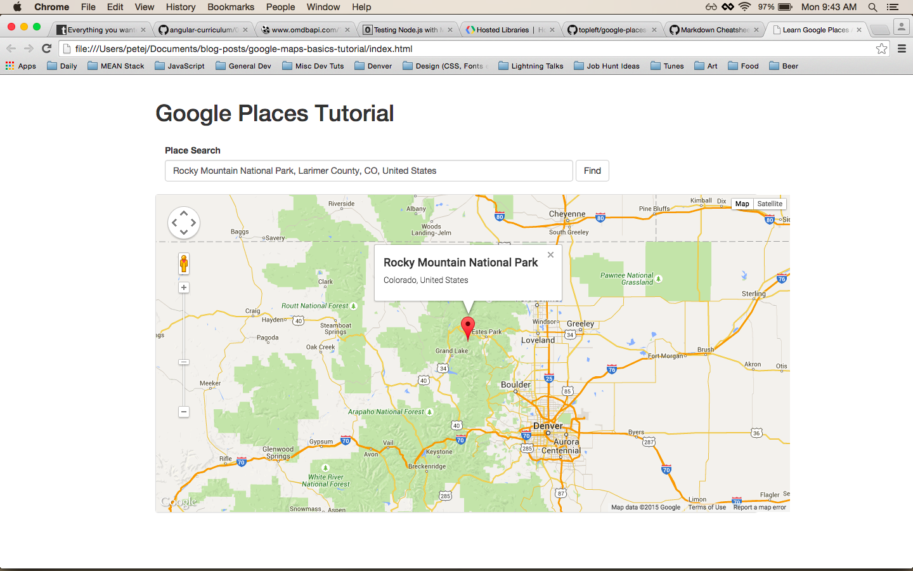
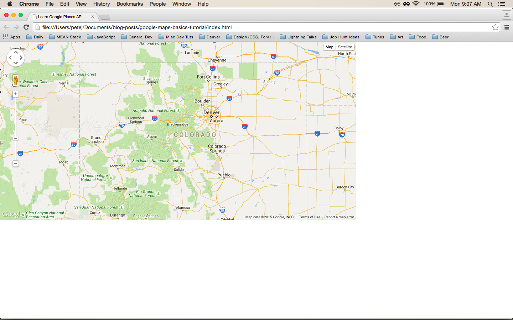
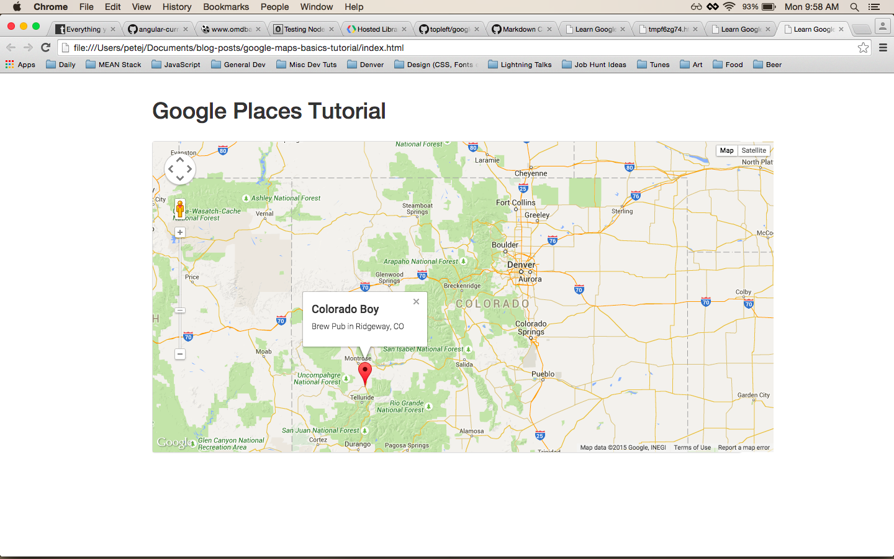
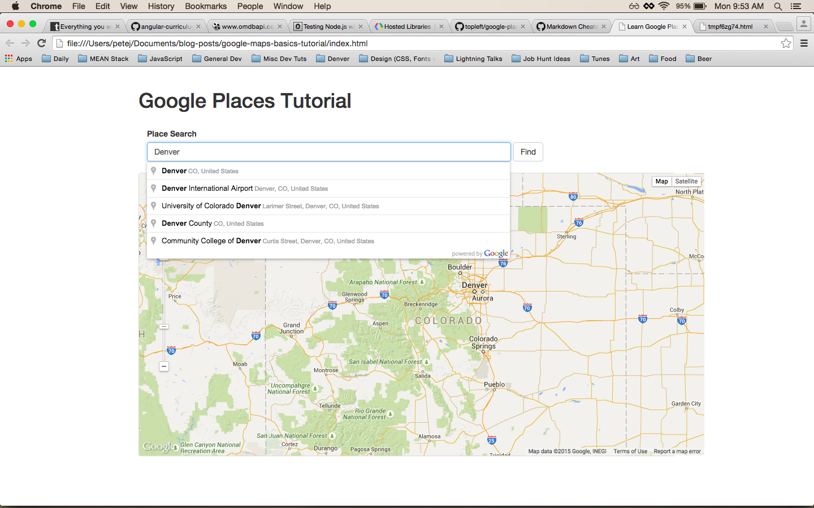

## Google Places API JavaScript Library

**Who doesn't love a good map!?! So let's make our own with the bare essentials of the Google Places API.**



The [Google Places API](https://developers.google.com/places/) is used by all Google maps to get detailed information on millions of locations around the world. This info can be used to plan your next holiday, find all your favorite coffee shops or maybe research a new business plan. By the end of this tutorial you will be able to add a map to your HTML document and place [markers](https://developers.google.com/maps/documentation/javascript/markers) on the map with an [info window](https://developers.google.com/maps/documentation/javascript/infowindows) via an [auto-complete search field](https://developers.google.com/maps/documentation/javascript/examples/places-autocomplete).

> This tutorial assumes a beginner ability in setting up web pages using JavaScript, jQuery, CSS and HTML.

Here we go...

### Part 1 - Setup

#### Create the Project Structure

Go [here](https://github.com/topleft/google-places-basics/tree/f87f0ae7f2ba34df9b72a6482835324a7390c7d1) for a copy of the structure I am using. Clone it down or cut and paste the contents into your own project structure or make your own files using this structure as a reference:

```sh
├── css
│   └── main.css
├── index.html
├── js
│   └── main.js
└── readme.md
```


#### Access the API

Google has made it super simple to get started with their maps and services. Add this script tag to your *index.html* file right below the jQuery script tag. If you're not quite sure where to put it, have a look at the project files [here](https://github.com/topleft/google-places-basics/tree/v2).

```html
<script type="text/javascript" src="https://maps.googleapis.com/maps/api/js?libraries=places"></script>
```

This script tag calls the Google Places JavaScript API, giving us access to the Google map objects and methods available via key words in our JavaScript.

When our program runs it will ask Google for information via a specific set of syntax or code that we will write into our *main.js* file. The details of this syntax has been made available to us in [this](https://developers.google.com/maps/documentation/javascript/tutorial) documentation. As a coder, you will learn to love excellent docs like these; they detail all the keys needed for unlocking Google maps.

#### Create a Map

Now lets create a map. Add the following line of code to *main.js* file inside the `document.on('ready')` event:

```sh
  var map = new google.maps.Map(document.getElementById('map-div'),{
    center: {lat:39.393981, lng:-106.016311},
    zoom: 7
  });
```

We-
* set the variable `map` to a new map object created by using the Google syntax,
* gave the map a place to live on the *index.html* file by grabbing the ID selector `map-div`,
* set the center property of the map to coordinates in Colorado, and
* set the 'zoom' property of the map.

This is just the basics. There are a lot more properties that you can add to a Google map. Check out the
[Map Object docs](https://developers.google.com/maps/documentation/javascript/3.exp/reference#MapOptions)
for more options to cutomize maps for your purposes.


#### Make Some Space
We specified an ID of `map-div` when we created our map object, so we need to put that into an html tag...probably a div :)

Add this code into *index.html* inside the body element.

```html
<div id="map"></div>
```

Finally, we need to create some space for our map to occupy. At this point, if you open up *index.html* in your browser by specifying the local path (mine looks like this: `file:///Users/petej/Documents/blog-posts/google-maps-basics-tutorial/index.html`) into the URL field, nothing will show on the page. This is because the map will not create a space for itself - it will only take up an area provided for it. How should we "create" space for our map?

CSS will do the trick.

> *Tip*: Another good way of opening the *index.html* file is by going into the terminal, navigating to the directory that this project is in (specifically where the html file is located) and typing `open index.html`, then hit enter. That should do it. For more great material on the command line checkout [Learn The Hard Way](http://cli.learncodethehardway.org/book/).

Add this to *main.css*:

```css
#map-div {
  height: 500px;
  width: 1000px;
}
```

Okay, lets open up *index.html* and see what we've got! Try to do it via the terminal (also referred to as the command line... bash... iTerm... shell...).




You can grab the finished files for Part 1 [here](https://github.com/topleft/google-places-basics/tree/v2).

---

### Part 2 - Markers and Info Windows


> Quick Note: If you are following along with the linked Github repository, you'll see I added some bootstrap styling to class this project up a bit. Bootstrap is a HTML, CSS, and JavaScript library that provides numerous helper styles for creating the basis of you web site/application.

#### Markers

Markers make Google maps functional and rich with information. For example, for your map, you may want to add markers to places that you've been in the world or all the breweries you want to visit on you next road trip. A paleantologist could pinpoint exact locations of where T-Rex fossils have been found and then share that map with her colleagues. Markers are powerful and fun - and adding them to your map is easy!

Markers are objects provided by the Google Places API and they, much like maps, have properties we can set and customize. Markers "belong" to a given map, so we need to specify the map, via an argument, when we create a new marker. we also need to set the position of the marker. We can do this in many ways, for now we will use latitude and longitude.

Add this code to *main.js*, just below the map instantiation (creating a new 'instance' or object of a certain type):

```javascript
var marker = new google.maps.Marker({
    position: {lat:38.153661, lng:-107.758774},
    map: map
  });
```

Test this out in your browser. What do you see?


#### Info Windows

What is that marker pointing to? Wouldn't it be nice to have some more information about this location? Google has an object for that - `InfoWindow`. :)

```javascript
  var infowindow = new google.maps.InfoWindow({
    content: "<div><h2>Colorado Boy</h2><p>Brew Pub in Ridgeway, CO</p></div>"
  });
```

We've created our info window, and now we need a way to access it. Add a click event handler to the marker:

```javascript
  marker.addListener('click', function() {
    infowindow.open(map, marker);
  });

```

Have a look at the two peices of code above and try to figure out why the info window opens on our marker. Info windows don't belong to markers like markers belong to maps. Instead, Info windows are there own object. The way we bind them to a marker is by passing that marker's variable name in when we call `.open()` on the info window.

You can grab the finished files for Part 2 [here](https://github.com/topleft/google-places-basics/tree/v3).




---

### Part 3 - Auto Complete

#### Search Field with Auto Complete

Hard Coding locations is ok, but we want our map to be dynamic. Like I was saying, Google provides tons of functionality with the Places API. We are going to take advantage of the auto complete feature for our search input.

#### Search Form

Start be adding a search form to index.html.

```
    <div class="row">
      <div class="col-md-8 col-md-offset-2">
        <form class="form-inline">
          <div class="form-group col-md-12">
            <div class="row">
            <div class="col-md-2">
            <label for="exampleInputName2">Place Search</label>
            </div>
            </div>
            <input type="text" class="form-control" id="place-input" placeholder="Find a place...">
          <button type="submit" class="btn btn-default" id="add-location">Find</button>
          </div>
        </form>
      </div>
    </div>
```

Again, there is some bootstrap magic in there, but all you really need is a `form` with an `input` and a `button`. Be sure to add the proper id's to the input and the button. These id's can be called whatever you choose, they will be used in our main.js file to grab on to values and listen for user events.

#### Auto-Complete

Open you main.js file and add this code:

```
var placeInput = document.getElementById('place-input');

var autocomplete = new google.maps.places.Autocomplete(placeInput);

autocomplete.bindTo('bounds', map);
```

We are doing a lot here in just 3 lines. I'll break it down per line:
1. Grabbing the input field with some vanilla javascript (vanilla just means plain ol' javascript) and storing it in the variable `placeInput`.
1. Creating a new instance of the Google AutoComplete object, binding it to our input by passing it in as an argument, and storing that object in the variable `autocomplete`.
1. Binding our autocomplete object to the bounds of our map. This will make the auto complete suggestions smarter by taking into account the current map bounds or view.

If you fire up the page in your browser you should be able to type into the input and see a list of suggestions populate! Sweet right!?!




#### Finding Places

We have a functioning search field, lets hook it up with the map and find some places.

Establish a variable called `place`. We do this in the scope of the `document.on('ready')` so that we can have access to it inside all of the function within this scope. For more on scope, check [this](http://toddmotto.com/everything-you-wanted-to-know-about-javascript-scope/) out.

Then add an event listener to `autocomplete`. The `'place_changed'` event is specific to Google Auto-Complete objects, and registers when the item in the suggestions list is selected. The code looks like this:

```
  var place;

  autocomplete.addListener('place_changed', function() {
    place = autocomplete.getPlace();
  });
```

Take at look at what is going on inside the event listener function. Google has provided really nice syntax for all of our objects and methods(methods are vary similar to functions) and you can read its meaning pretty easily. In this code we set the `place` variable to a Place object that is returned by the Auto-Complete. This is our first taste of a Google 'Place' object. They are packed with information on location, address, business type, Google rating, phone number, realtime information like isOpen (yeah...now! so cool). Check out all the details a google Place gives you access to [here](https://developers.google.com/maps/documentation/javascript/places#place_details).


#### Move the Map on Click

Lets move the map to the given place when our user clicks the 'Find' button.

```
  $(document).on("click",'#add-location', function(e){
      e.preventDefault();

      // if place has no geometry, it is not what we expected (or need)
      // so we break out with a return statement
      if (! place.geometry) {
        return;
      }

      // if place has a viewport property within gometry property
      // we use that to set our map view
      else if (place.geometry.viewport) {
        map.fitBounds(place.geometry.viewport);
      }

      // if no viewort property, we use location to set our map view
      // and specify a zoom of 17
      else {
        map.setCenter(place.geometry.location);
        map.setZoom(17);
      }
  });
```

Check out the comments to see whats going on, but I also want to talk about the `.viewport` property. Some Place objects have a `.viewport` property within `.geometry`. This is a predefined view of this location that will shift and zoom the map apropriately for this specific location. If you are looking up the [Pacific Ocean](https://www.google.com/maps/place/Pacific+Ocean/@-13.7036473,-148.9712961,3z/data=!3m1!4b1!4m2!3m1!1s0x76ed042c30f318eb:0x8eff14a070876cbc) then the map is zoomed way out as to see the whole ocean. If you checkout [Brussels, Belgium](https://www.google.com/maps/place/Brussels,+Belgium/@50.8387,4.363405,12z/data=!3m1!4b1!4m2!3m1!1s0x47c3c486740f9fff:0x10099ab2f4c8030) we get a much more zoomed in map.

#### Moving Marker and Info Window

We need to move our `Marker` and `Info Window` instantiations (remember, that means instances of a certain object type) to inside this click event so that they are bound to our Place object.

Take this code  and put it underneath the if/else statement, but remeber to keep it inside the `on.("click")` event.

```
 var marker = new google.maps.Marker({
      position: place.geometry.location,
      map: map
    });

    var infowindow = new google.maps.InfoWindow({
      content: "<div><h4>"+place.name+"</h4><p>"+place.formatted_address+"</p></div>"
    });

    marker.addListener('click', function() {
      infowindow.open(map, marker);
    });
```

### Wrap Up
And voila! Here is your very own custom Google Map. These are the bare essntials of getting a map with a search feature on the page, as well as access to the powerful Google Places Library. From here you could add an array (or a database) where your places are stored, create a listing in a side bar to show more details, or maybe personalize the look of your map with styles and custom icons.

You can grab the finished files for Part 3 [here](https://github.com/topleft/google-places-basics/tree/v4).


If you go further with Google Places, be sure to look into the [`Place.place_id`](https://developers.google.com/places/place-id) which is a super handy way of grabbing locations and calling up there details. Google has assiged a place_id to millions of locations around the world and have allowed their users to keep them updated with current information.


